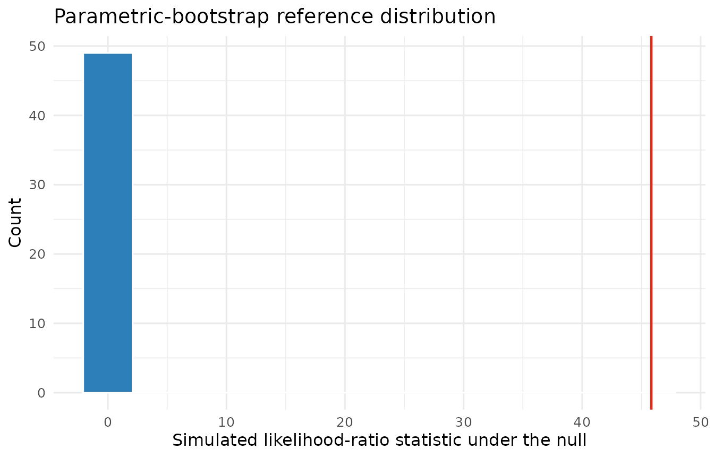

# Covariance intervals and boundary-aware model comparisons

## Scope

This vignette covers two inferential questions that differ from
inference on fixed effects:

1.  confidence intervals for variance and correlation parameters;
2.  likelihood-ratio comparisons when the null model can place a
    variance on the boundary at zero.

The usual chi-squared likelihood-ratio reference can fail at a boundary
([Self and Liang 1987](#ref-self1987)). A parametric bootstrap instead
estimates the null distribution by simulating from the fitted smaller
model and refitting both models to every simulated response ([Davison
and Hinkley 1997](#ref-davison1997)).

## Confidence intervals for covariance parameters

The `theta_` selector requests all covariance parameters. Variance
intervals are formed on the log scale, and correlation intervals are
formed on the Fisher-z scale. The delta-method standard errors are
transformed before the normal critical value is applied. This keeps
variance limits positive and correlation limits inside `(-1, 1)`.

``` r

orthodont <- as.data.frame(nlme::Orthodont)

fit <- lmm(
  orthodont,
  distance ~ age + Sex,
  random = ~ age | Subject
)

confint(fit, parm = "theta_")
#>                                  Lower      Upper
#> random.var.(Intercept)      1.86157472 32.8778858
#> random.var.age              0.01051166  0.2500562
#> random.cor.age.(Intercept) -0.95415621 -0.1431681
#> residual.var                1.17693860  2.5025388
```

The default `confint(fit)` remains backward compatible and returns only
fixed effects. Use `parm = c("beta_", "theta_")` to request both
families. These are local Wald intervals based on the observed
likelihood Hessian. They should not be interpreted as profile-likelihood
or bootstrap intervals, especially when the Hessian is poorly
conditioned or an estimate is close to a boundary.

## Parametric-bootstrap likelihood-ratio test

The following comparison asks whether the Orthodont data support a
random subject intercept beyond an independent Gaussian residual model.
Both models are fitted by ML because covariance-model likelihood-ratio
comparisons must use the same fixed effects under ML.

``` r

null_fit <- lmm(
  orthodont,
  distance ~ age + Sex,
  method = "ML"
)

random_fit <- lmm(
  orthodont,
  distance ~ age + Sex,
  random = ~ 1 | Subject,
  method = "ML"
)
```

The ordinary call retains the asymptotic chi-squared reference and emits
a boundary warning. The bootstrap alternative is requested explicitly.

``` r

asymptotic <- suppressWarnings(anova(null_fit, random_fit))
bootstrap <- anova(
  null_fit,
  random_fit,
  test = "parametric.bootstrap",
  nsim = 49,
  seed = 20260714
)

data.frame(
  method = c("asymptotic chi-squared", "parametric bootstrap"),
  statistic = c(asymptotic$Chisq[2], bootstrap$Chisq[2]),
  p_value = c(asymptotic$p.value[2], bootstrap$p.value[2])
)
#>                   method statistic      p_value
#> 1 asymptotic chi-squared  45.82714 1.291618e-11
#> 2   parametric bootstrap  45.82714 2.000000e-02
```

For each simulation, `lmmix` draws a Gaussian response using the fitted
mean and marginal covariance of the null model, refits both models by
ML, and recomputes the likelihood-ratio statistic. The finite-simulation
correction is

``` math
\widehat p = \frac{1 + \sum_{b=1}^{B}
I(T_b \geq T_{\mathrm{obs}})}{B + 1}.
```

The simulated null distribution is retained as an attribute for
diagnostics.

``` r

bootstrap_statistics <- attr(bootstrap, "bootstrap")[[2]]$statistics

ggplot(
  data.frame(statistic = bootstrap_statistics),
  aes(x = statistic)
) +
  geom_histogram(bins = 12, color = "white", fill = "#2C7FB8") +
  geom_vline(
    xintercept = bootstrap$Chisq[2],
    color = "#D7301F",
    linewidth = 0.9
  ) +
  labs(
    x = "Simulated likelihood-ratio statistic under the null",
    y = "Count",
    title = "Parametric-bootstrap reference distribution"
  ) +
  theme_minimal(base_size = 12)
```



The 49 simulations above keep the installed vignette reasonably fast and
give a p-value resolution of `1 / 50`. They are a reproducible
demonstration, not a publication-grade Monte Carlo analysis. For
substantive inference, increase `nsim`, commonly to at least 999, and
examine the retained distribution and the number of successful refits.
The returned p-value uses only successful refits and the method warns if
any refit fails.

## Reproducibility

Supplying `seed` makes the simulated reference distribution reproducible
and restores the caller’s random-number state on exit. Omitting `seed`
uses and advances the current R random-number stream. The fitted
objects, simulation count, successful-refit count, and simulated
statistics remain available in the returned comparison object.

``` r

sessionInfo()
#> R version 4.6.1 (2026-06-24)
#> Platform: x86_64-pc-linux-gnu
#> Running under: Ubuntu 24.04.4 LTS
#> 
#> Matrix products: default
#> BLAS:   /usr/lib/x86_64-linux-gnu/openblas-pthread/libblas.so.3 
#> LAPACK: /usr/lib/x86_64-linux-gnu/openblas-pthread/libopenblasp-r0.3.26.so;  LAPACK version 3.12.0
#> 
#> locale:
#>  [1] LC_CTYPE=C.UTF-8       LC_NUMERIC=C           LC_TIME=C.UTF-8       
#>  [4] LC_COLLATE=C.UTF-8     LC_MONETARY=C.UTF-8    LC_MESSAGES=C.UTF-8   
#>  [7] LC_PAPER=C.UTF-8       LC_NAME=C              LC_ADDRESS=C          
#> [10] LC_TELEPHONE=C         LC_MEASUREMENT=C.UTF-8 LC_IDENTIFICATION=C   
#> 
#> time zone: UTC
#> tzcode source: system (glibc)
#> 
#> attached base packages:
#> [1] stats     graphics  grDevices utils     datasets  methods   base     
#> 
#> other attached packages:
#> [1] ggplot2_4.0.3 lmmix_0.3.0  
#> 
#> loaded via a namespace (and not attached):
#>  [1] Matrix_1.7-5        gtable_0.3.6        jsonlite_2.0.0     
#>  [4] dplyr_1.2.1         compiler_4.6.1      tidyselect_1.2.1   
#>  [7] jquerylib_0.1.4     systemfonts_1.3.2   scales_1.4.0       
#> [10] textshaping_1.0.5   yaml_2.3.12         fastmap_1.2.0      
#> [13] lattice_0.22-9      R6_2.6.1            labeling_0.4.3     
#> [16] generics_0.1.4      knitr_1.51          tibble_3.3.1       
#> [19] desc_1.4.3          bslib_0.11.0        pillar_1.11.1      
#> [22] RColorBrewer_1.1-3  rlang_1.3.0         cachem_1.1.0       
#> [25] xfun_0.60           fs_2.1.0            sass_0.4.10        
#> [28] S7_0.2.2            otel_0.2.0          cli_3.6.6          
#> [31] pkgdown_2.2.1       withr_3.0.3         magrittr_2.0.5     
#> [34] digest_0.6.39       grid_4.6.1          nlme_3.1-169       
#> [37] lifecycle_1.0.5     vctrs_0.7.3         evaluate_1.0.5     
#> [40] glue_1.8.1          numDeriv_2016.8-1.1 farver_2.1.2       
#> [43] ragg_1.5.2          rmarkdown_2.31      tools_4.6.1        
#> [46] pkgconfig_2.0.3     htmltools_0.5.9
```

Davison, A. C., and D. V. Hinkley. 1997. *Bootstrap Methods and Their
Application*. Cambridge University Press.
<https://doi.org/10.1017/CBO9780511802843>.

Self, Steven G., and Kung-Yee Liang. 1987. “Asymptotic Properties of
Maximum Likelihood Estimators and Likelihood Ratio Tests Under
Nonstandard Conditions.” *Journal of the American Statistical
Association* 82 (398): 605–10.
<https://doi.org/10.1080/01621459.1987.10478472>.
